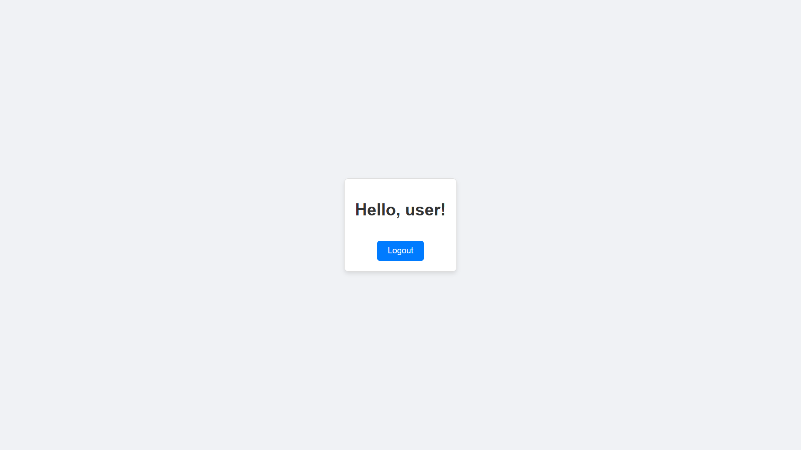
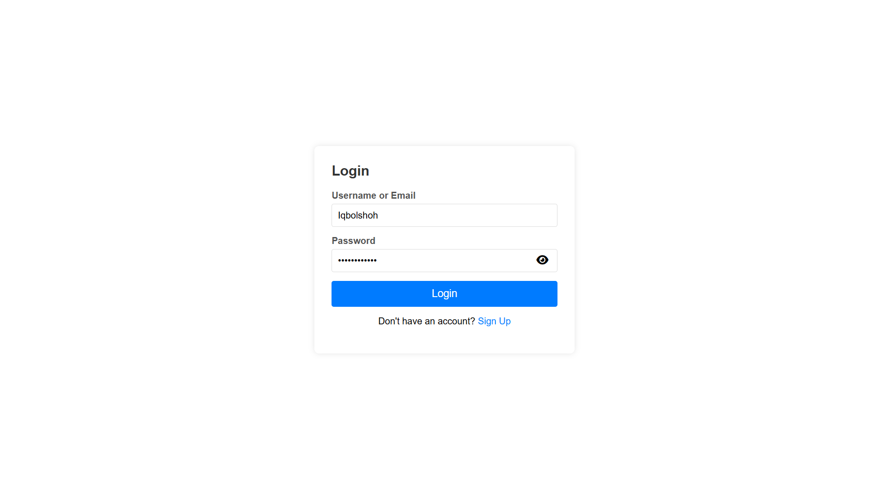

# PHP Authentication System

This repository contains a user authentication system built with PHP and MySQL. It includes features such as user registration, login, and logout functionalities.



## Installation

To run this project locally, follow these steps:

1. Clone the repository:
   ```bash
   git clone https://github.com/iqbolshoh/php-authentication.git
   ```
2. Navigate to the project directory:
   ```bash
   cd php-authentication
   ```
3. Make sure you have a local server setup (e.g., XAMPP, WAMP, MAMP) and place the project files in the server's root directory.

4. Import the database:
   - Open your MySQL database management tool (e.g., phpMyAdmin).
   - Create a new database.
   - Import the `database.sql` file into the new database.

5. Update the database configuration:
   - Open `includes/config.php` and update the database connection details.

## Usage

To use the application, open your browser and navigate to `http://localhost/php-authentication`. This will load the main page of the application.

### User Registration

1. Go to the signup page (`signup/`).
2. Fill out the registration form and submit it.
3. Upon successful registration, you will be redirected to the login page.


### User Login

1. Go to the login page (`login/`).
2. Enter your credentials and submit the form.
3. Upon successful login, you will be redirected to the index page (`index.php`).



### User Logout

1. Click the logout button or navigate to the logout page (`logout/`).
2. You will be logged out and redirected to the login page.

## Technologies Used

<div style="display: flex; flex-wrap: wrap; gap: 5px;">
    
    
    
    
    
</div>

## Contributing

Contributions are welcome! If you have suggestions or want to enhance the project, feel free to fork the repository and submit a pull request.

## Connect with Me

I love connecting with new people and exploring new opportunities. Feel free to reach out to me through any of the platforms below:

<table>
    <tr>
        <td>
            <a href="https://github.com/iqbolshoh">
                
            </a>
        </td>
        <td>
            <a href="https://t.me/iqbolshoh_777">
                
            </a>
        </td>
        <td>
            <a href="https://www.linkedin.com/in/iiqbolshoh/">
                
            </a>
        </td>
        <td>
            <a href="https://instagram.com/iqbolshoh_777" target="blank"></a>
        </td>
        <td>
            <a href="https://wa.me/qr/22PVFQSMQQX4F1">
                
            </a>
        </td>
        <td>
            <a href="https://x.com/iqbolshoh_777">
                
            </a>
        </td>
        <td>
            <a href="mailto:iilhomjonov777@gmail.com">
                
            </a>
        </td>
    </tr>
</table>
