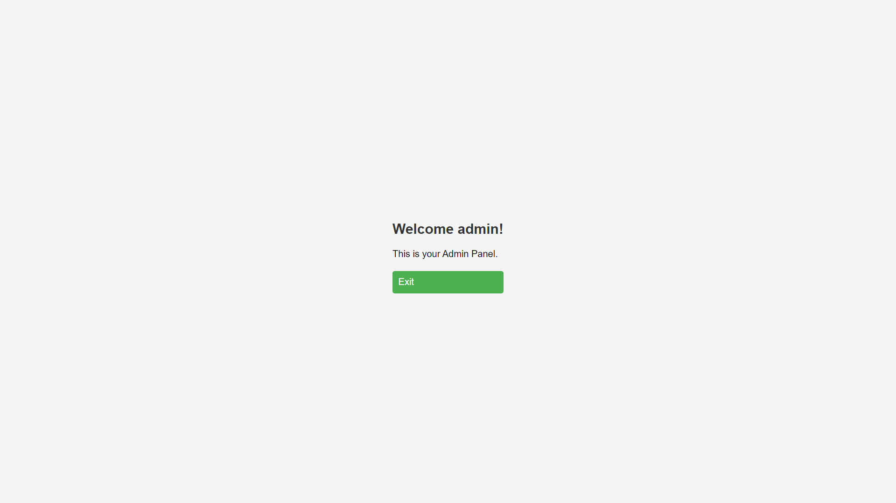
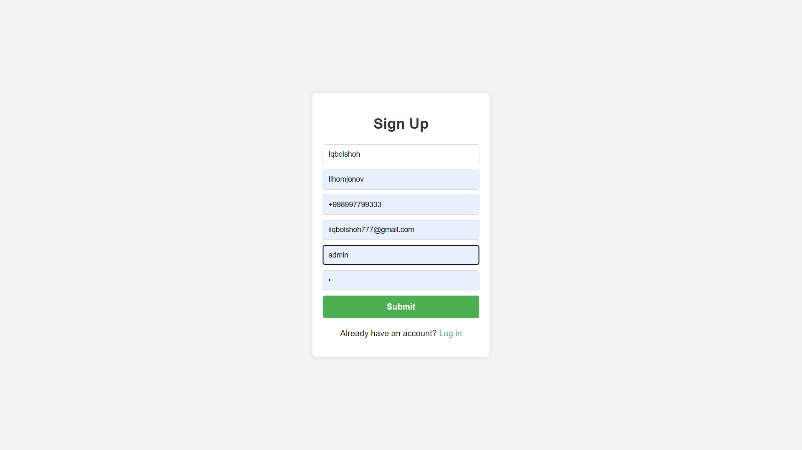
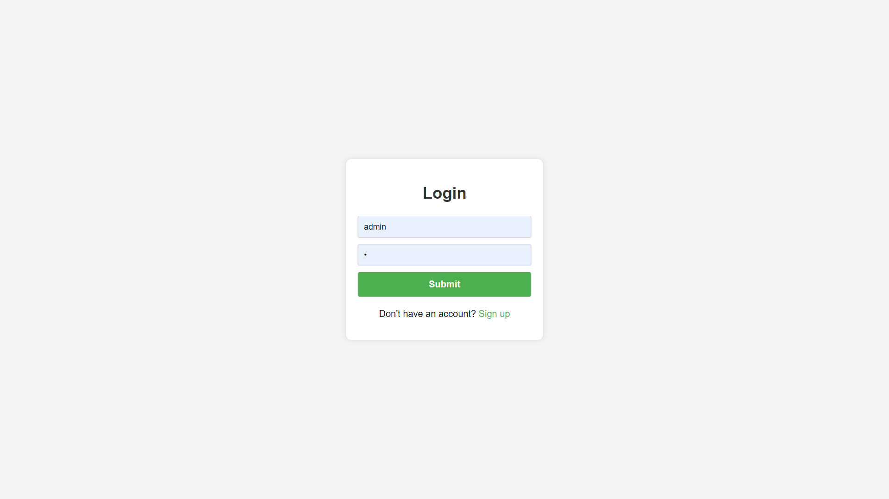

# PHP Authentication System



This repository contains a user authentication system built with PHP and MySQL. It includes features such as user registration, login, and logout functionalities.

## Table of Contents

- [Project Structure](#project-structure)
- [Installation](#installation)
- [Usage](#usage)
- [Files Description](#files-description)
- [Technologies Used](#technologies-used)
- [Contributing](#contributing)
- [Contact](#contact)

## Project Structure

The project structure is as follows:

```
.
├── css
│   ├── styles.css
│   ├── signup.css
│   ├── login.css
├── images
│   ├── banner.png
│   ├── login.png
│   ├── signup.png
├── config.php
├── database.sql
├── index.php
├── login
│   ├── index.php
├── logout
│   ├── index.php
├── signup
│   ├── index.php
├── README.md
```

## Installation

To run this project locally, follow these steps:

1. Clone the repository:
   ```bash
   git clone https://github.com/iqbolshoh/php-authentication.git
   ```
2. Navigate to the project directory:
   ```bash
   cd php-authentication
   ```
3. Make sure you have a local server setup (e.g., XAMPP, WAMP, MAMP) and place the project files in the server's root directory.

4. Import the database:
   - Open your MySQL database management tool (e.g., phpMyAdmin).
   - Create a new database.
   - Import the `database.sql` file into the new database.

5. Update the database configuration:
   - Open `includes/config.php` and update the database connection details.

## Usage

To use the application, open your browser and navigate to `http://localhost/php-authentication`. This will load the main page of the application.

### User Registration

1. Go to the signup page (`signup/`).
2. Fill out the registration form and submit it.
3. Upon successful registration, you will be redirected to the login page.



### User Login

1. Go to the login page (`login/`).
2. Enter your credentials and submit the form.
3. Upon successful login, you will be redirected to the index page (`index.php`).



### User Logout

1. Click the logout button or navigate to the logout page (`logout.php`).
2. You will be logged out and redirected to the login page.

## Files Description

### Directories

- **css/**: Contains custom CSS files for styling.
  - **styles.css**: Custom styles for the application.
- **images/**: Contains image files used in the application.
  - **banner.png**: Banner image for the README file.
  - **login.png**: Screenshot of the login page.
  - **signup.png**: Screenshot of the signup page.
- **includes/**: Contains configuration and other include files.
  - **config.php**: Database configuration file.
- **sql/**: Contains SQL files.
  - **database.sql**: SQL file to create and populate the database.

### PHP Files

- **index.php**: Main entry point of the application after login.
- **login/**: Handles user login functionality.
- **logout.php**: Handles user logout functionality.
- **signup/**: Handles user registration functionality.

## Technologies Used

-  **HTML5**
-  **CSS3**
-  **PHP**
-  **MySQL**

## Contributing

Contributions are welcome! If you have any suggestions, bug reports, or feature requests, feel free to open an issue or submit a pull request.

1. Fork the repository.
2. Create your feature branch (`git checkout -b feature/YourFeature`).
3. Commit your changes (`git commit -m 'Add YourFeature'`).
4. Push to the branch (`git push origin feature/YourFeature`).
5. Open a pull request.

## Connect with Me

I love connecting with new people and exploring new opportunities. Feel free to reach out to me through any of the
platforms below:

<table>
    <tr>
        <td>
            <a href="https://t.me/iqbolshoh_777">
                
            </a>
        </td>
        <td>
            <a href="https://instagram.com/iqbolshoh_777" target="blank"></a>
        </td>
        <td>
            <a href="https://wa.me/qr/22PVFQSMQQX4F1">
                
            </a>
        </td>
        <td>
            <a href="https://x.com/iqbolshoh_777">
                
            </a>
        </td>
        <td>
            <a href="https://www.linkedin.com/in/iqbolshoh/">
                
            </a>
        </td>
        <td>
            <a href="mailto:iilhomjonov777@gmail.com">
                
            </a>
        </td>
    </tr>
</table>
